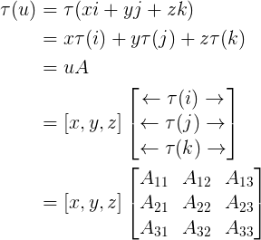
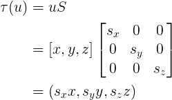
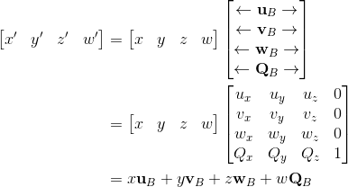
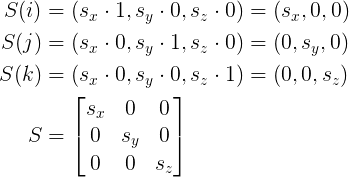
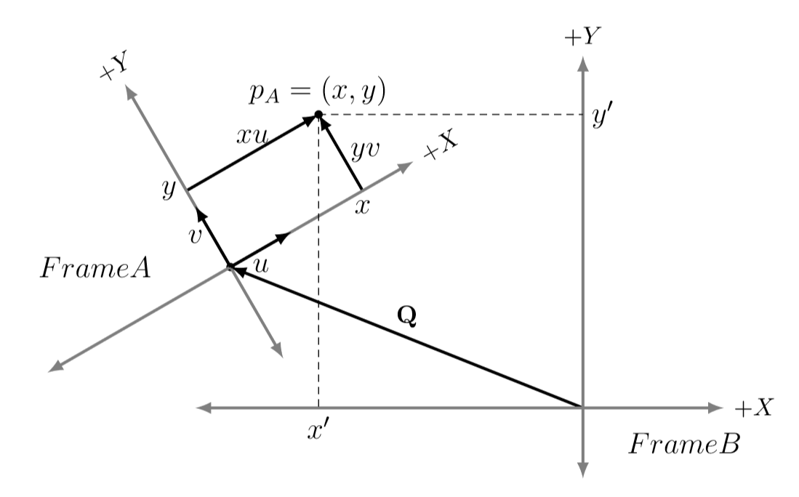
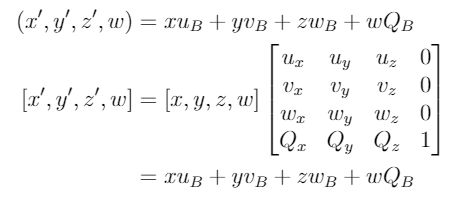
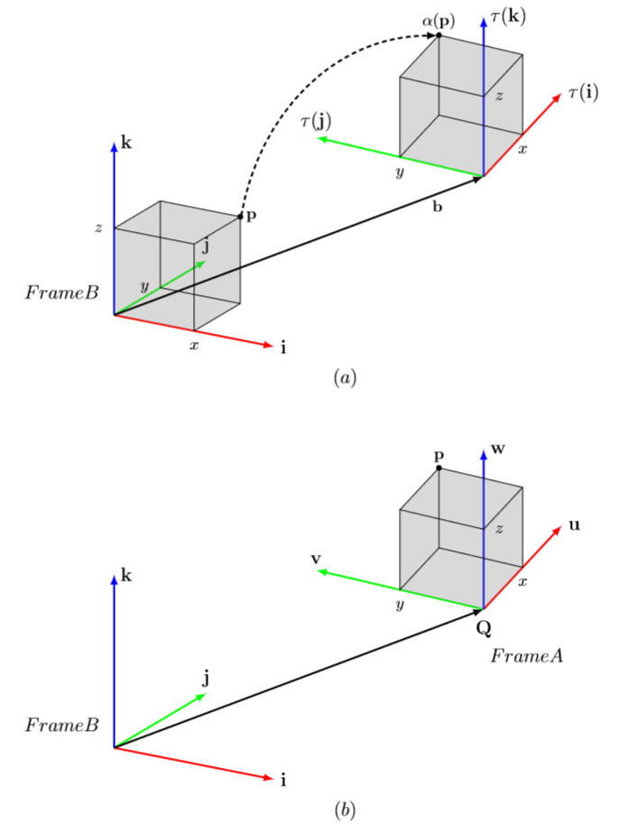

# Abstract 

변환에 대해 정리한다.

# 선형변환

변환을 의미하는 함수를 `\tau` 라고 했을 때 그 함수가 다음과 같은 두가지 성질을 만족하면 선형변환이라고 한다. `u`, `v` 는 벡터이고 `k` 는 스칼라이다.


```latex
\begin{aligned} 
\tau(u + v) &= \tau(u) + \tau(t) \\
\tau(ku)  &= k\tau(u) \\
\end{aligned}
```

컴퓨터로 선형변환을 구현하기 위해서는 행렬의 곱연산이 필요하다. 그리고 그 행렬은 다음과 같이 제작한다.

`u = (x, y, z)` 라 할 때 좌표축을 나타내는 벡터 `i, j, k` 를 이용하여 
다음과 같이 표현해보자. 벡터 `i, j, k` 는 삼차원 공간에서 `x, y, z` 축과 같은 방향의 단위벡터로 표준기저벡터(standard basis vector)라고 부른다.


```latex
\begin{aligned}
u &= (x, y, z) \\
  &= xi + yj + zk \\
  &= x(1,0,0) + y(0,1,0) + z(0,0,1)
\end{aligned}
```

선형변환 `\tau` 에 벡터 `u` 를 입력으로 하면 다음과 같이 식을 전개할 수 있다. 결국 선형변환은 행렬 `A` 의 곱셈연산으로 표현 가능하다.



```latex
\begin{aligned}
\tau(u) &= \tau(xi + yj + zk) \\
       &= x\tau(i) + y\tau(j) + z\tau(k) \\
       &= uA \\
       &= [x,y,z]\begin{bmatrix} \leftarrow \tau(i) \rightarrow 
                 \\ \leftarrow \tau(j) \rightarrow 
                 \\ \leftarrow \tau(k) \rightarrow 
                 \end{bmatrix} \\
       &= [x,y,z]\begin{bmatrix} A_{11} & A_{12} & A_{13}
                 \\  A_{21} & A_{22} & A_{23} 
                 \\  A_{31} & A_{32} & A_{33}
                 \end{bmatrix} \\
\end{aligned} \\
```

예를 들어 벡터 `u` 에 행렬 `S` 를 곱셈하면 비례를 표현할 수 있다.



```latex
\begin{aligned} 
\tau (u) &= uS \\
         &= [x, y, z] \begin{bmatrix}
            s_{x} & 0 & 0\\ 
            0& s_{y} & 0\\ 
            0&  0& s_{z}
            \end{bmatrix} \\
         &= (s_{x}x,s_{y}y,s_{z}z) \\
\end{aligned}
```

예를 들어 벡터 `u` 에 행렬 `R_{x}` 을 곱셈하면 `x` 축을 기준으로 한 회전을 표현할 수 있고
`R_{y}` 을 곱셈하면 `y` 축을 기준으로 한 회전을 표현할 수 있고
`R_{z}` 을 곱셈하면 `z` 축을 기준으로 한 회전을 표현할 수 있다.


```latex
\begin{aligned}
R_{x} &= \begin{bmatrix}
         1 & 0 & 0\\ 
         0 & cos\theta & sin\theta\\ 
         0 & -sin\theta & cos\theta
         \end{bmatrix} \\
R_{y}    &= \begin{bmatrix}
            cos\theta & 0 & -sin\theta\\ 
            0 & 1 & 0\\ 
            sin\theta & 0 & cos\theta
            \end{bmatrix} \\
R_{z}    &= \begin{bmatrix}
            cos\theta & sin\theta & 0\\ 
            -sin\theta & cos\theta & 0\\ 
            0 & 0 & 1
            \end{bmatrix}
\end{aligned}
```

# 아핀변환

아핀변환(Affine Transformation)은 선형변환(Linear Transformation)에 위치변환(Translation)을 추가한 변환이다.

그러나 벡터는 위치변환의 영향을 받지 않는다. 벡터는 크기와 방향만으로 표현되기 때문이다. 따라서 위치변환은 점만 해당된다.
한편 구현을 위해서는 벡터와 점을 동일하게 취급해야 할 필요가 있다.
그래서 동차좌표(homogeneous coordinates)가 고안되었다.

3D 공간에서 동차좌표는 하나의 원소를 추가하여 표현한다. 마지막 원소가 0 이면 벡터를 의미하고 1이면 점을 의미한다. 예를 들어 `(x, y, z, 0)` 은 벡터를 의미하고 `(x, y, z, 1)` 은 점을 의미한다.

아핀변환을 `\alpha` 와 선형변환행렬 `A`, 이동변환벡터 `b` 를 이용하여 다음과 같이 표현해 보자.


```latex
\begin{aligned} 
\\\alpha(u) &= uA+b \\
            &= [x,y,z]\begin{bmatrix} A_{11} & A_{12} & A_{13}
                      \\ A_{21} & A_{22} & A_{23} 
                      \\ A_{31} & A_{32} & A_{33}
                      \end{bmatrix}+[b_{x},b_{y},b_{z}] \\
            &=[x',y',z'] \\
            
\end{aligned} 
```

앞서 언급한 수식에 동차좌표가 도입되면 `u` 는 벡터 혹은 점이 가능하다.


```latex
\left[ x,y,z,1 \right]\begin{bmatrix}
                      A_{11} & A_{12} & A_{13} & 0\\ 
                      A_{21} & A_{22} & A_{23} & 0\\ 
                      A_{31} & A_{32} & A_{33} & 0\\ 
                      b_{x} & b_{y} & b_{z} & 1
                      \end{bmatrix} = [x',y',z',1]
```

아핀변환 `\alpha` 는 선형변환 `\tau` 와 벡터 `b` 를 이용하여 다음과 같이 표현할 수 있다.


```latex
\begin{aligned}
\alpha(x, y, z) &= \tau(x, y, z) + \bold b \\
                &= x \tau(\bold i) + y \tau(\bold j) + z \tau(\bold k) + \bold b \\
                &= \begin{bmatrix}
                     x & y & z & w
                   \end{bmatrix} 
                   \begin{bmatrix}
                     \leftarrow \tau(\bold i) \rightarrow \\
                     \leftarrow \tau(\bold i) \rightarrow \\
                     \leftarrow \tau(\bold i) \rightarrow \\
                     \leftarrow \bold b \rightarrow \\
                   \end{bmatrix} \\
                &= \begin{bmatrix}
                     {x}' & {y}' & {z}' & {w}'
                   \end{bmatrix} 
\end{aligned}
```

위의 식을 잘 살펴 보면 아핀변환 `\alpha` 는 기저벡터 `i, j, k` 를 선형변환하고 벡터 `b` 를 덧셈연산한 것과 같음을 알 수 있다.

# 변환의 합성

행렬 `S` 는 스케일링변환, 행렬 `R` 는 회전변환, 행렬 `T` 는 이동변환을 의미한다고 하자. 8개의 버텍스로 구성된 큐브를 앞서 언급한 세가지 행렬을 곱셈연산하여 변환을 다음과 같이 구현할 수 있다. `(for i = 0, 1,..., 7)`


```latex
\begin{aligned}
((v_{i}S)R)T &= ({v_{i}}'R)T \\
             &= {v_{i}}''T \\
             &= {v_{i}}'''
\end{aligned}
```

위의 식을 잘 살펴보면 `SRT` 를 미리 구해놓고 이것을 행렬 `C` 라고 하면 행렬의 곱셈연산이 줄어들기 때문에 성능을 향상시킬 수 있다.


```latex
\begin{aligned}
v_{i}(SRT) &= v_{i}C \\
           &= {v_{i}}'''
\end{aligned}
```

# 좌표계의 변환

우리는 주로 섭씨 온도를 사용한다. 예를 들어 섭씨 온도 `100` 을 화씨 온도로 변환 하려면 어떻게 해야할까? 바로 다음과 같은 식을 이용하면 된다.


```latex
\begin {aligned} 
T_{F} &= \frac{9}{5} T_{c} + 32^{\circ} \\
      &= \frac{9}{5} (100^{\circ}) + 32^{\circ}
      &= 212^{\circ}F
\end{aligned}
```

유사한 방법으로 3D 공간의 벡터 혹은 점을 다른 좌표계에서 표현하는 방법을 알아보자.

먼저 벡터의 경우를 살펴보자. 예를 들어 2D 공간에서 A 좌표계를 기준으로 한 좌표 `P_A(x, y)` 를 B 좌표계를 기준으로 한 좌표 `P_B({x}',{y}')` 으로 표현해보자.

`P_{A}` 를 A 좌표계의 기저벡터 `u, v` 를 이용하여 다음과 같이 표현할 수 있다.


```latex
\begin {aligned} 
\bold P_{A} = x \bold u + y \bold v
\end{aligned}
```

이번에는 `P_{B}` 를 B 좌표계의 기저벡터 `{u}', {v}'` 를 이용하여 다음과 같이 표현할 수 있다.


```latex
\begin {aligned} 
\bold P_{B} = x \bold {u}' + y \bold {v}'
\end{aligned}
```

`{u}', {v}'` 는 각각 `u, v` 를 선형변환하여 얻어 낸 것이다. 따라서 선형변환에 해당하는 행렬 A 를 `u, v` 에 곰셉연산하여 `{u}', {v}'` 를 구할 수 있다.

```latex
\begin {aligned} 
\bold u A   &= \bold {u}'
\bold v A   &= \bold {v}'
\bold P_{B} &= x \bold {u}' + y \bold {v}'
            &= x u A + y v A
\end{aligned}
```

예를 들어서 A 좌표계의 좌표 `1, 2` 를 B 좌표계의 좌표로 변환해 보자. A 좌표계를 시계방향으로 90 도 회전하여 B 좌표계를 얻어냈다고 하자.

```latex
\begin {aligned} 
\bold u A   &= \bold {u}'
\bold v A   &= \bold {v}'
\bold P_{B} &= x \bold {u}' + y \bold {v}'
            &= 1 \cdot (1,0) A + 2 \cdot (0, 1) A
            &= (-2, 1)
\end{aligned}
```

정리하면 A 좌표계의 `x, y` 와 기저벡터 `u, v` 그리고 A 좌표계를 B 좌표계로 변환하기 위한 행렬 `A` 를 알면 `{x}',{y}'` 를 구할 수 있다.

지금까지 2D 를 기준으로 설명한 것을 3D 를 기준으로 다음과 같이 확장할 수 있다.


```latex
\begin {aligned} 
\bold P_{B} = x \bold u_{B} + y \bold v_{B} + z \bold w_{B}
\end{aligned}
```

점의 경우는 다음과 같이 이동변환을 추가하여 이해할 수 있다.


```latex
\begin {aligned} 
\bold P_{B} = x \bold u_{B} + y \bold v_{B} + z \bold w_{B} + \bold Q_{B}
\end{aligned}
```

# 좌표변환과 좌표계의 변환

특정좌표 `x, y, z` 를 아핀변환한 것은 다음과 같다.


```latex
\begin{aligned}
\alpha(x, y, z) &= \tau(x, y, z) + \bold b \\
                &= x \tau(\bold i) + y \tau(\bold j) + z \tau(\bold k) + \bold b \\
                &= \begin{bmatrix}
                     x & y & z & w
                   \end{bmatrix} 
                   \begin{bmatrix}
                     \leftarrow \tau(\bold i) \rightarrow \\
                     \leftarrow \tau(\bold i) \rightarrow \\
                     \leftarrow \tau(\bold i) \rightarrow \\
                     \leftarrow \bold b \rightarrow \\
                   \end{bmatrix} \\
                &= \begin{bmatrix}
                     {x}' & {y}' & {z}' & {w}'
                   \end{bmatrix} 
\end{aligned}
```

특정좌표 `x, y, z` 의 좌표계를 변환한 것은 다음과 같다.



```latex
\begin{aligned}
\begin{bmatrix}
  {x}' & {y}' & {z}' & {w}'
\end{bmatrix} 
                &= \begin{bmatrix}
                     x & y & z & w
                   \end{bmatrix} 
                   \begin{bmatrix}
                     \leftarrow \bold u_{B} \rightarrow \\
                     \leftarrow \bold v_{B} \rightarrow \\
                     \leftarrow \bold w_{B} \rightarrow \\
                     \leftarrow \bold Q_{B} \rightarrow \\
                   \end{bmatrix} \\
                &= \begin{bmatrix}
                     x & y & z & w
                   \end{bmatrix} 
                   \begin{bmatrix}
                     u_{x} & u_{y} & u_{z} & 0 \\
                     v_{x} & v_{y} & v_{z} & 0 \\
                     w_{x} & w_{y} & w_{z} & 0 \\
                     Q_{x} & Q_{y} & Q_{z} & 1 \\
                   \end{bmatrix} \\
                &= x \bold u_{B} + y \bold v_{B} + z \bold w_{B} + w \bold Q_{B}
\end{aligned}
```

아핀변환을 한 것은 좌표계를 변환한 것과 같다.

# 비례 선형변환 증명

비례변환은 다음 그림의 식을 통해 선형변환의 성질을 만족한다는 것을 확인할 수 있다.


```latex
\begin {aligned} 
S(u + v) &= (s_{x}(u_{x} + v_{x}), s_{y}(u_{y} + v_{y}), s_{z}(u_{z} + v_{z})) \\
         &= (s_{x}u_{x} + s_{x}v_{x}, s_{y}u_{y} + s_{y}v_{y}, s_{z}u_{z} + s_{z}v_{z}) \\
         &= (s_{x}u_{x}, s_{y}u_{y}, s_{z}u_{z}) + (s_{x}v_{x}, s_{y}v_{y}, s_{z}v_{z}) \\
         &= S(u) + S(v) \\
\\
S(ku) &= (s_{x}ku_{x}, s_{y}ku_{y}, s_{z}ku_{z}) \\
      &= k(s_{x}u_{x}, s_{y}u_{y}, s_{z}u_{z}) \\
      &= kS(u) \\
\end{aligned}
```

비례변환에 표준기저벡터를 곱하면 각 축에 해당하는 원소의 크기를 변경하는 비례행렬을 얻을 수 있다.



```latex
\begin{aligned}
S(i) &= (s_{x}\cdot 1, s_{y}\cdot 0, s_{z}\cdot 0) = (s_{x}, 0, 0) \\
S(j) &= (s_{x}\cdot 0, s_{y}\cdot 1, s_{z}\cdot 0) = (0, s_{y}, 0) \\
S(k) &= (s_{x}\cdot 0, s_{y}\cdot 0, s_{z}\cdot 1) = (0, 0, s_{z}) \\
S    &=  \begin{bmatrix}
         s_{x} & 0 & 0\\ 
         0& s_{y} & 0\\ 
         0&  0& s_{z}
         \end{bmatrix}
\end{aligned}
```

비례변환의 행렬 S는 비례행렬(scaling matrix)이라고 부른다. 

`s_{x}`는 x축의 비율을, `s_{y}`는 y축의 비율을, `s_{z}`는 z축의 비율을 조절한다.


# 회전 선형변환 증명

벡터 v를 축 n에 대해 회전하는 변환을 표현하기 위해서는 복잡한 식의 계산이 필요하다.


```latex
\documentclass[tikz,border=10pt]{standalone}

\usepackage{tikz}
\usepackage{rotating}

\usetikzlibrary{scopes}
\usetikzlibrary{quotes,angles}
\usetikzlibrary{intersections}

\begin{document}

\begin{tikzpicture}
    \def\picrot{15}
	\def\a{3.5} \def\b{1.5}
	\def\xp{0} \def\yp{-6}
	\def\angvalue{50}
	\def\ptsize{1.0pt}
	\tikzset{p_style/.style={draw=black}}
	\tikzset{arrow_style/.style={>=latex,ultra thick}}
	
	\matrix[column sep=1cm] {
    	
        \begin{turn}{\picrot}
        	\draw[name path=ellipse,black,thick]
        		(0,0) circle[x radius = \a cm, y radius = \b cm];
            %\draw (0,0) ellipse (\a cm and \b cm);
        	\coordinate (P) at (\xp,\yp);
        	
        	\path[name path=lineOV] (0,0)--(\a,0);
        	\path [name intersections={of = ellipse and lineOV}];
        	\coordinate (V) at (intersection-1);
        	\path[name path=lineOA] (0,0)--(240:\a cm);
        	\path [name intersections={of = ellipse and lineOA}];
        	\coordinate (A) at (intersection-1);
        	\path[name path=lineOB] (0,0)--(360-\angvalue:\a cm);
        	\path [name intersections={of = ellipse and lineOB}];
        	\coordinate (B) at (intersection-1);
        	
        	\draw[black,thick] (0,0) -- (0,3);
        	{[arrow_style,->]
        	    \draw[black!50](P) -- (V) node[black,very near end,right,rotate=360-\picrot] {\large$\textbf{v}$};
        	    \draw[blue!50](0,0) -- (V) node[black,midway,sloped,above] {\large $v_{\perp}=v-proj_{n}(v)$};
        	    \draw[blue](0,0) -- (B) node[black,very near end,sloped,above] {\large $R_{n}(v_{\perp})$};
        	    \draw[green](0,0) -- (A) node[black,midway,sloped,above] {\large $n\times v$};
        	    \draw[red](P) -- (0,0) node[black,midway,sloped,above] { $proj_{n}(v)$};
        	    \draw[black](P) -- (B) node[black,very near end,right,rotate=360-\picrot] {\large $R_{n}(v)$};
        	    \draw[black](P) -- (0,\yp+1) node[black,near end,left,rotate=360-\picrot] {\large $\textbf{n}$};
        	}
        	\coordinate (O) at (0,0);
        	\draw pic[draw=black,angle eccentricity=1.2,angle radius=1.7cm] {angle=V--P--O};
        	\draw pic["\Large $\alpha$",angle eccentricity=1.2,angle radius=1.7cm] {angle=V--P--B};
        	\draw pic["\Large $\theta$",draw=black,angle eccentricity=1.5,angle radius=0.5cm] {angle=B--O--V};
        	
        	\foreach \p in {A,B,V}
        		\fill[p_style] (\p) circle (\ptsize);
        \end{turn}
            
        &
            
        \def\angvalue{50}
        \def\rad{3}
        
        \begin{turn}{340}
        	\draw[name path=proj,black,thick]
        		(0,0) circle(\rad);
        	\coordinate (O) at (0,0);
        	\coordinate (A) at (\rad,0);
        	\coordinate (B) at (0,-\rad);
        	\path [name path=lineOV] (0,0)--(360-\angvalue:\rad cm);
        	\path [name intersections={of = proj and lineOV}];
        	\coordinate (V) at (intersection-1);
        	
        	\coordinate (CA) at ({\rad*cos(\angvalue)},0);
        	\coordinate (SB) at (0,{-\rad*sin(\angvalue)});
        	
        	{[arrow_style,->]
        	    \draw[black!50](O) -- (A);
        	    \draw[black!50](O) -- (B);
        	    \draw[blue](O) -- (V) node[black,midway,sloped,above] {\large$R_{n}(v_{\perp})$};
        	    \draw[blue!50](O) -- (CA) node[black,midway,sloped,above] {\large$cos(\theta)v_{\perp}$};
        	    \draw[green!50](O) -- (SB) node[black,midway,sloped,above,rotate=180] {\large$sin(\theta)n\times v$};
        	}
        	\draw pic["\Large $\theta$",draw=black,angle eccentricity=1.5,angle radius=0.5cm] {angle=V--O--A};
            \draw[densely dashed](CA)--(V);
            \draw[densely dashed](SB)--(V);
        	
        	\foreach \p in {O,A,B,V}
        		\fill[draw=black] (\p) circle (1.0pt);
        \end{turn}
    \\   
	};
\end{tikzpicture}

\end{document}
```

(위의 그림에서 회전각은 n의 진행방향을 기준으로 반시계방향으로 측정하며, n의 크기는 1이라고 가정한다.)

먼저, 벡터 v를 축 n에 평행한 정사영벡터 `proj_{n}(v)`와 n에 수직인 벡터 `v_{\perp}`로 쪼갠다. 정사영벡터는 n과 평행하기 때문에 수직인 벡터의 회전방법만 알아내면 회전 후의 v를 알아낼 수 있다.

`R_{n}(v_{\perp})`를 알아내기 위해서 n과 `v_{\perp}`에 수직인 벡터 `n \times v`(외적)를 구한다. `n \times v`의 크기는 다음과 같은 공식으로 `v_{\perp}`와 크기가 같다는 것을 알 수 있다.


```latex
\begin {aligned} 
\left\| n \times v \right\| &= \left\| n \right\| \left\| v \right\| sin\alpha \\
                            &= \left\| v \right\| sin\alpha \\
                            &= \left\| v_{\perp} \right\|
\end{aligned}
```

`v_{\perp}`와 `n \times v` 두 개의 벡터를 통해 `R_{n}(v_{\perp})`를 구할 수 있다.


```latex
R_{n}(v_{\perp}) = cos\theta v_{\perp} + sin\theta(n \times v)
```

이를 통해 다음과 같은 공식을 이끌어낼 수 있다.


```latex
\begin {aligned} 
R_{n}(v) &= proj_{n}(v) + R_{n}(v_{\perp}) \\
         &= (n\cdot v)n + cos\theta v_{\perp} + sin\theta(n\times v) \\
         &= (n\cdot v)n + cos\theta(v-(n\cdot v)n) + sin\theta(n\times v) \\
         &= cos\theta v +(1-cos\theta)(n\cdot v)n + sin\theta(n\times v)
\end{aligned}
```

해당 공식 내부의 벡터를 (x,y,z) 형태로 변환하면 다음과 같이 표현할 수 있다.


```latex
\begin {aligned} 
R_{n}(v_{x},v_{y},v_{z}) &= c(v_{x},v_{y},v_{z}) \\
                         &\ + (1-c)(n_{x}v_{x}+n_{y}v_{y}+n_{z}v_{z})(n_{x},n_{y},n_{z}) \\
                         &\ + s(n_{y}v_{z}-n_{z}v_{y},n_{z}v_{x}-n_{x}v_{z},n_{x}v_{y}-n_{y}v_{z})
\\ &
\\ & (c = cos\theta,s = sin\theta)
\end{aligned}
```

위의 식에 표준기저벡터를 적용하여 나온 벡터들을 행으로 삼아서 하나의 행렬을 만들면 벡터 v를 축 n에 대해 회전시키는 회전행렬이 나온다.


```latex
\begin{aligned} 
\\R_{n} &= \begin{bmatrix}
          c+(1-c)(n_{x})^2 & (1-c)n_{x}n_{y}+sn_{z} & (1-c)n_{x}n_{z}-sn_{y}\\ 
          (1-c)n_{x}n_{y}-sn_{z} & c+(1-c)(n_{y})^2 & (1-c)n_{y}n_{z}+sn_{x}\\ 
          (1-c)n_{x}n_{z}+sn_{y} & (1-c)n_{y}n_{z}-sn_{x} & c+(1-c)(n_{z})^2
          \end{bmatrix}
\\ & (c = cos\theta,s = sin\theta)
\end{aligned}
```

회전행렬의 각 행벡터는 단위길이이고, 서로 직교이기 때문에 정규직교이다. 직교행렬은 역행렬이 자신의 전치행렬과 같다는 속성이 있다.


```latex
\\R_{n}^{-1}=R_{n}^{T}=\begin{bmatrix}
c+(1-c)(n_{x})^2 & (1-c)n_{x}n_{y}-sn_{z} & (1-c)n_{x}n_{z}+sn_{y}\\ 
(1-c)n_{x}n_{y}+sn_{z} & c+(1-c)(n_{y})^2 & (1-c)n_{y}n_{z}-sn_{x}\\ 
(1-c)n_{x}n_{z}-sn_{y} & (1-c)n_{y}n_{z}+sn_{x} & c+(1-c)(n_{z})^2
\end{bmatrix}
\\(c=cos\theta,s=sin\theta)
```

회전축이 x축, y축, z축인 경우(n = (1,0,0), (0,1,0), (0,0,1))는 회전행렬이 매우 간단해진다.


```latex
\begin{aligned}
R_{x} &= \begin{bmatrix}
         1 & 0 & 0\\ 
         0 & cos\theta & sin\theta\\ 
         0 & -sin\theta & cos\theta
         \end{bmatrix} \\
R_{y}    &= \begin{bmatrix}
            cos\theta & 0 & -sin\theta\\ 
            0 & 1 & 0\\ 
            sin\theta & 0 & cos\theta
            \end{bmatrix} \\
R_{z}    &= \begin{bmatrix}
            cos\theta & sin\theta & 0\\ 
            -sin\theta & cos\theta & 0\\ 
            0 & 0 & 1
            \end{bmatrix}
\end{aligned}
```

-----

# 변환들의 합성

S가 비례행렬이고 R이 회전행렬, T가 이동행렬이라고 할 때, 임의의 정점 v에 세 변환을 연달아 적용하는 방법은 두 가지가 있다. 행렬을 차례대로 적용하는 방법과 행렬의 곱을 적용하는 방법이다.


```
\\((vS)R)T=(v'R)T=v''T=v'''
\\\\v(SRT)=v'''
```

행렬을 차례대로 적용하는 방법은 정점의 수가 많아질 때 계산에 많은 자원이 소모된다. 예를 들어 정점이 2만개가 된다면 차례대로 적용할 경우 계산 횟수는 20000 x 3 = 60000이 된다. 하지만 행렬의 곱을 적용하면 계산 횟수는 20000 + 2 = 20002가 된다.

# 좌표 변경 변환

한 좌표계의 좌표를 다른 좌표계의 좌표로 변환하는 것을 좌표 변경 변환(change of coordinate transformation)이라고 한다.

물체의 기하구조가 실제로 움직였거나 변형된 것으로 간주하는 회전, 이동, 비례변환과는 대조적으로 좌표계가 변경되어 기하구조의 좌표'표현'이 변하게 된다.


```
\documentclass[tikz,border=10pt]{standalone}

\usepackage{tikz}
\usepackage{rotating}

\usetikzlibrary{scopes}
\usetikzlibrary{intersections}
\usetikzlibrary{calc}

\begin{document}

\begin{tikzpicture}
    \def\rotangle{30}
    \def\angvalue{30}
    %\def\rad{3}
    %\def\x{2} \def\y{1.5}
	\tikzset{arrow_style/.style={>=latex,very thick}}
	
	\matrix[column sep=1cm] {
        \begin{turn}{\rotangle}
            \coordinate(PA) at (\angvalue:2.5 cm);
            \draw[densely dashed,blue!40]let \p{PA}=(PA) in (PA) -- (\x{PA},0) node [black,below,rotate=360-\rotangle] {\large$x$};
            \draw[densely dashed,blue!40]let \p{PA}=(PA) in (PA) -- (0,\y{PA})node [black,left,rotate=360-\rotangle] {\large$y$};
            \draw [arrow_style,black!50,<->] (0,-3)--(0,3) node [black,above] {$+Y$};
            \draw [arrow_style,black!50,<->] (-3,0)--(3,0) node [black,right] {$+X$};
            \draw [arrow_style,blue,->] (0,0)--(PA) node [black,above,rotate=360-\rotangle] {\Large$p_{A}=(x,y)$};
        \end{turn}
        \coordinate [label=left:\large$FrameA$] (t) at (1,-3);
        
        &
            
        \coordinate(PB) at (\angvalue+\rotangle:2.5 cm);
        \path[name path=lineYV,shift={(PB)}] (0,0)--(\angvalue+180:2.5 cm);
        \path[name path=lineXU,shift={(PB)}] (0,0)--(\angvalue+270:2.5 cm);
        \path[name path=lineOV] (0,0)--(\angvalue+90:2.5 cm);
        \path[name path=lineOU] (0,0)--(\angvalue:2.5 cm);
	    \path [name intersections={of = lineYV and lineOV}];
        \coordinate(yv) at (intersection-1);
	    \path [name intersections={of = lineXU and lineOU}];
        \coordinate(xu) at (intersection-1);
        
        \draw[densely dashed,black]let \p{PB}=(PB) in (PB) -- (\x{PB},0) node [black,below] {\large$x'$};
        \draw[densely dashed,black]let \p{PB}=(PB) in (PB) -- (0,\y{PB})node [black,left] {\large$y'$};
        {[arrow_style]
            \draw [black!50,<->] (0,-1.5)--(0,3) node [black,above] {$+Y$};
            \draw [black!50,<->] (-3,0)--(3,0) node [black,right] {$+X$};
            \draw [blue,->] (0,0)--(PB) node [black,right] {\Large$p_{B}=(x',y')$};
          
            \draw[densely dashed,blue!40] (PB)--(yv);
            \draw[densely dashed,blue!40] (PB)--(xu);
            \draw[densely dashed,blue!40,->] (0,0)--(yv) node [black,left] {\large $yv$};
            \draw[densely dashed,blue!40,->] (0,0)--(xu) node [black,right] {\large $xu$};
            \draw[black,->] (0,0)--(\angvalue+90:1 cm) node [black,midway,left] {\large $v$};
            \draw[black,->] (0,0)--(\angvalue:1 cm) node [black,near end,below] {\large $u$};
        }
            
        \coordinate [label=left:\large$FrameB$] (t) at (1,-3);
    \\   
	};
    
\end{tikzpicture}

\end{document}
```

위의 그림은 두 좌표계 A와 B, 그리고 벡터 p가 있을 때 좌표계 B에 상대적인 p의 좌표를 도식으로 보여주고 있다. 위의 그림에서 u와 v를 좌표계 A의 x축과 y축 방향의 단위벡터라고 한다면, 다음과 같이 표현할 수 있다.


```
p=xu+yv
```

이 식의 벡터들을 좌표계 B에서 동일한 방식으로 표현할 수 있다.


```
p_{B}=xu_{B}+yv_{B}
```

따라서, 좌표계 B에 상대적인 벡터 `u_{B}`와 `v_{B}`를 알면 항상 `p_{B} = (x',y')`를 구할 수 있다. 이를 3차원으로 일반화하면, 다음과 같이 표현할 수 있다. `u_{B}, v_{B}, w_{B}`는 각각 x,y,z축 방향 단위벡터들을 좌표계 B에 상대적으로 표현한 벡터들이다.


```
p_{B}=xu_{B}+yv_{B}+zw_{B}
```

점에 대한 좌표 변경 변환은 벡터에 대한 것과 약간 다르지만, 계산 방법은 비슷하다. 좌표계 B에 상대적인좌표계 A의 원점을 알면 나머지는 벡터 계산과 동일하다.



```
\documentclass[tikz,border=10pt]{standalone}

\usepackage{tikz}
\usepackage{rotating}

\usetikzlibrary{scopes}
\usetikzlibrary{calc}

\begin{document}

\begin{tikzpicture}
    \def\rotangle{30}
    \def\angvalue{30}
    \def\rad{3}
    \def\x{2} \def\y{1.5}
	\tikzset{arrow_style/.style={>=latex,very thick}}
	
        \coordinate (PA) at (\angvalue:2.5 cm);
        \begin{turn}{\rotangle}
    		\fill[draw=black] (PA) circle (1.5pt);
    		\fill[draw=black] (0,0) circle (1.5pt);
            
        {[arrow_style]
            \draw[->]let \p{PA}=(PA) in (\x{PA},0) node [black,below,rotate=360-\rotangle] {\large$x$}--(PA) node [black,right,midway,rotate=360-\rotangle] {\large$yv$};
            \draw[->]let \p{PA}=(PA) in (0,\y{PA}) node [black,left,rotate=360-\rotangle] {\large$y$}--(PA) node [black,above,midway,rotate=360-\rotangle] {\large$xu$};
            \draw [black!50,<->] (0,-1.5)--(0,3) node [black,above] {$+Y$};
            \draw [black!50,<->] (-3,0)--(3,0) node [black,right] {$+X$};
            \draw[->] (0,0)--(0,1) node [black,midway,left,rotate=360-\rotangle] {\large $v$};
            \draw[->] (0,0)--(1,0) node [black,midway,below,rotate=360-\rotangle] {\large $u$};
            
        }
        
        \end{turn}
        \coordinate [label=left:\large$FrameA$] (t) at (-1,0);
        
        % frame B center : 5,-2
        {[arrow_style]
            \draw [->] (5,-2)--(0,0) node [black,above,midway] {$\mathbf{Q}$};
            \draw [black!50,<->] (5,-3)--(5,3) node [black,above] {$+Y$};
            \draw [black!50,<->] (-0.5,-2)--(7,-2) node [black,right] {$+X$};
        }
        \coordinate[label=above:\large${p_{A}=(x,y)}$] (PA) at (\rotangle+\angvalue:2.5 cm);
        \draw[densely dashed]let \p{PA}=(PA) in (PA) -- (\x{PA},-2) node [black,below] {\large$x'$};
        \draw[densely dashed]let \p{PA}=(PA) in (PA) -- (5,\y{PA})node [black,right] {\large$y'$};
	
        \coordinate [label=right:\large$FrameB$] (t) at (5.5,-2.5);
    
\end{tikzpicture}

\end{document}
```

위의 그림에서, 좌표계 B의 점 `p_{B}`는 다음과 같이 표현할 수 있다.


```
p_{B}=xu_{B}+yv_{B}+Q_{B}
```

3차원으로 일반화하면, 다음과 같이 표현할 수 있다. `u_{B}, v_{B}, w_{B}`는 각각 x,y,z축 방향 단위벡터들을 좌표계 B에 상대적으로 표현한 벡터들이고, `Q_{B}`는 좌표계 A의 원점을 좌표계 B에 상대적으로 표현한 점이다.


```
p_{B}=xu_{B}+yv_{B}+zw_{B}+Q_{B}
```

좌표 변경 변환도 동차좌표를 사용하여 벡터와 점을 처리하는 하나의 공식으로 만들 수 있으며, 행렬로 표현할 수 있다.



```
\\(x',y',z',w)=xu_{B}+yv_{B}+zw_{B}+wQ_{B}
\\\\\left[x',y',z',w\right]=[x,y,z,w]\begin{bmatrix}
u_{x} & u_{y} & u_{z} & 0\\ 
v_{x} & v_{y} & v_{z} & 0\\ 
w_{x} & w_{y} & w_{z} & 0\\ 
Q_{x} & Q_{y} & Q_{z} & 1
\end{bmatrix}
\\\\=xu_{B}+yv_{B}+zw_{B}+wQ_{B}
```

위의 식에서 표현된 4x4 행렬을 좌표 변경 행렬(change of coordinate matrix) 또는 좌표계 변경 행렬(change of frame matrix)라고 부르고, 행렬이 수행하는 변환을 지칭할 때 "변환한다(convert)" 또는 "사상한다(map)"라고 말한다.

# 변환 행렬 대 좌표 변경 행렬

'능동적'변환(비례, 회전, 이동)과 좌표 변경 변환은 수학적으로 동치(equivalence) 관계이다. 능동 변환을 좌표 변경 변환으로 해석하는 것이 가능하며, 그 역도 마찬가지이다.



```
\documentclass[tikz,border=10pt]{standalone}

\usepackage{tikz}
\usepackage{tikz-3dplot}

\usetikzlibrary{scopes}

\begin{document}

\begin{tikzpicture}
	\tikzset{arrow_style/.style={>=latex,very thick}}
    \def\AxisSize{4}
    \def\CubeSize{2}
        
	\matrix[row sep=1cm] {
        \tdplotsetmaincoords{70}{30}
        \begin{scope}[tdplot_main_coords]
            % The vertex at V
            \coordinate (P) at (\CubeSize,\CubeSize,\CubeSize);
            
            % axis draw
            {[arrow_style]
                \draw [red,->] (0,0,0)--(\AxisSize,0,0) node [black,above,right] {\large $\mathbf{i}$};
                \draw [green,->] (0,0,0)--(0,\AxisSize,0) node [black,above] {\large $\mathbf{j}$};
                \draw [blue,->] (0,0,0)--(0,0,\AxisSize) node [black,right] {\large $\mathbf{k}$};
            }
            
            % cube draw
            \fill[black!50, opacity=0.3]
              (0,\CubeSize,\CubeSize) -- (\CubeSize,\CubeSize,\CubeSize) -- (\CubeSize,0,\CubeSize) -- (0,0,\CubeSize) -- cycle; 
            \fill[black!50, opacity=0.3]
              (0,0,\CubeSize) -- (\CubeSize,0,\CubeSize) -- (\CubeSize,0,0) -- (0,0,0) -- cycle;
            \fill[black!50, opacity=0.3]
              (\CubeSize,0,0) -- (\CubeSize,\CubeSize,0) -- (\CubeSize,\CubeSize,\CubeSize) -- (\CubeSize,0,\CubeSize) -- cycle;
            \draw (P) -- (\CubeSize,0,\CubeSize) --(0,0,\CubeSize) --(0,\CubeSize,\CubeSize) --(P) --(\CubeSize,\CubeSize,0) --(\CubeSize,0,0) --(\CubeSize,0,\CubeSize);
            \draw (\CubeSize,\CubeSize,0) -- (0,\CubeSize,0) --(0,\CubeSize,\CubeSize);
            
            % dot label draw
    		\fill[draw=black] (P) circle (1.5pt) node [above,right]{$\mathbf{p}$};
    		\node[label=below:$x$] at (\CubeSize,0,0);
    		\node[label=left:$y$] at (0,\CubeSize,0);
    		\node[label=left:$z$] at (0,0,\CubeSize);
        \end{scope}
        
        \tdplotsetmaincoords{60}{-65}
        \begin{scope}[tdplot_main_coords,xshift=8cm,yshift=3cm]
            % The vertex at V
            \coordinate (P) at (\CubeSize,\CubeSize,\CubeSize);
            
            % axis draw
            {[arrow_style]
                \draw [red,->] (0,0,0)--(\AxisSize,0,0) node [black,above,right] {\large $\tau(\mathbf{i})$};
                \draw [green,->] (0,0,0)--(0,\AxisSize,0) node [black,above] {\large $\tau(\mathbf{j})$};
                \draw [blue,->] (0,0,0)--(0,0,\AxisSize) node [black,right] {\large $\tau(\mathbf{k})$};
            }
            
            % cube draw
            \fill[black!50, opacity=0.3]
              (0,\CubeSize,\CubeSize) -- (\CubeSize,\CubeSize,\CubeSize) -- (\CubeSize,0,\CubeSize) -- (0,0,\CubeSize) -- cycle; 
            \fill[black!50, opacity=0.3]
              (0,0,\CubeSize) -- (\CubeSize,0,\CubeSize) -- (\CubeSize,0,0) -- (0,0,0) -- cycle;
            \fill[black!50, opacity=0.3]
              (0,\CubeSize,0) -- (0,\CubeSize,\CubeSize) -- (0,0,\CubeSize) -- (0,0,0) -- cycle;
            \draw (P) -- (\CubeSize,0,\CubeSize) --(0,0,\CubeSize) --(0,\CubeSize,\CubeSize) --(P) --(\CubeSize,\CubeSize,0) --(\CubeSize,0,0) --(\CubeSize,0,\CubeSize);
            \draw (\CubeSize,\CubeSize,0) -- (0,\CubeSize,0) --(0,\CubeSize,\CubeSize);
            
            % dot label draw
    		\fill[draw=black] (P) circle (1.5pt) node [above]{$\alpha(\mathbf{p})$};
    		\node[label=below:$x$] at (\CubeSize,0,0);
    		\node[label=below:$y$] at (0,\CubeSize,0);
    		\node[label=right:$z$] at (0,0,\CubeSize);
        \end{scope}
        
        \draw[->,>=latex,very thick] (0,0) -- (8cm,3cm) node [black,below,very near end] {$\mathbf{b}$};
        \draw[->,>=latex,very thick,densely dashed] (2.75,2.15) to[out=80,in=180] (7,6.05);
        \coordinate [label=left:\large$FrameB$] (t) at (-0.2,0.5);
        \coordinate [label=\large$(a)$] (t) at (5,-1.7);
    
	\\
        \tdplotsetmaincoords{70}{30}
        \begin{scope}[tdplot_main_coords]
            % The vertex at V
            \coordinate (P) at (\CubeSize,\CubeSize,\CubeSize);
            
            % axis draw
            {[arrow_style]
                \draw [red,->] (0,0,0)--(\AxisSize,0,0) node [black,above,right] {\large $\mathbf{i}$};
                \draw [green,->] (0,0,0)--(0,\AxisSize,0) node [black,above] {\large $\mathbf{j}$};
                \draw [blue,->] (0,0,0)--(0,0,\AxisSize) node [black,right] {\large $\mathbf{k}$};
            }
        \end{scope}
        
        \tdplotsetmaincoords{60}{-65}
        \begin{scope}[tdplot_main_coords,xshift=8cm,yshift=3cm]
            % The vertex at V
            \coordinate (P) at (\CubeSize,\CubeSize,\CubeSize);
            
            % axis draw
            {[arrow_style]
                \draw [red,->] (0,0,0)--(\AxisSize,0,0) node [black,above,right] {\large $\mathbf{u}$};
                \draw [green,->] (0,0,0)--(0,\AxisSize,0) node [black,above] {\large $\mathbf{v}$};
                \draw [blue,->] (0,0,0)--(0,0,\AxisSize) node [black,right] {\large $\mathbf{w}$};
            }
            
            % cube draw
            \fill[black!50, opacity=0.3]
              (0,\CubeSize,\CubeSize) -- (\CubeSize,\CubeSize,\CubeSize) -- (\CubeSize,0,\CubeSize) -- (0,0,\CubeSize) -- cycle; 
            \fill[black!50, opacity=0.3]
              (0,0,\CubeSize) -- (\CubeSize,0,\CubeSize) -- (\CubeSize,0,0) -- (0,0,0) -- cycle;
            \fill[black!50, opacity=0.3]
              (0,\CubeSize,0) -- (0,\CubeSize,\CubeSize) -- (0,0,\CubeSize) -- (0,0,0) -- cycle;
            \draw (P) -- (\CubeSize,0,\CubeSize) --(0,0,\CubeSize) --(0,\CubeSize,\CubeSize) --(P) --(\CubeSize,\CubeSize,0) --(\CubeSize,0,0) --(\CubeSize,0,\CubeSize);
            \draw (\CubeSize,\CubeSize,0) -- (0,\CubeSize,0) --(0,\CubeSize,\CubeSize);
            
            % dot label draw
    		\fill[draw=black] (P) circle (1.5pt) node [above]{$\mathbf{p}$};
    		\node[label=below:$x$] at (\CubeSize,0,0);
    		\node[label=below:$y$] at (0,\CubeSize,0);
    		\node[label=right:$z$] at (0,0,\CubeSize);
        \end{scope}
        
        \draw[->,>=latex,very thick] (0,0) -- (8cm,3cm);
    	\node[label=below:\large$\mathbf{Q}$] at (8cm,3cm);
        \coordinate [label=right:\large$FrameA$] (t) at (8,2);
        \coordinate [label=left:\large$FrameB$] (t) at (-0.2,0.5);
        \coordinate [label=\large$(b)$] (t) at (5,-1.7);
    \\
	};
\end{tikzpicture}

\end{document}
```

(a)에서는 하나의 좌표계 B를 기준으로 아핀변환을 적용해서 입방체의 위치와 방향을 변경한다. (b)에서는 A와 B라는 두 개의 좌표계를 사용하여 A에 상대적인 입방체 점들의 좌표를 B에 상대적인 좌표들로 변환한다. 두 경우 모두 좌표계 B를 기준으로 `\alpha(p) = (x',y',z',w) = p_{B}`가 성립한다. b = Q이고 `\tau(i) = u, \tau(j) = v, \tau(k) = w`이다.
